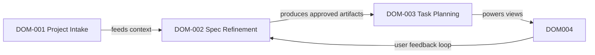

# Domain Map

Use this file to describe durable project domains, upstream or downstream dependencies, and related briefs that should be reviewed together.

## When To Fill This File

- The project is large enough to split work across multiple briefs
- Shared APIs, platforms, or workflows are reused by several design bundles
- Reviewers need a stable map of upstream and downstream impact

## Usage Rules

- Keep one entry per durable domain rather than per screen or endpoint
- Record upstream and downstream domains explicitly
- Add related brief IDs when a brief depends on or extends the domain
- Prefer stable domain names that survive multiple feature iterations
- Keep Mermaid node labels aligned with the `DOM-xxx` identifiers listed below

## Relationship Snapshot

## Domains

### DOM-001 Project Intake
- purpose: ユーザーが入力したプロジェクト概要や仕事内容を最初の作業コンテキストとして取り込み、仕事やプロジェクト全般の精緻化の起点を作る
- owns:
  - テンプレート入力と自由文入力を組み合わせたプロジェクト初期入力
  - 目的、スコープ、制約の一次整理
  - 精緻化開始前のコンテキスト保存
- upstream_domains:
  - `none`
- downstream_domains:
  - `DOM-002`
- related_briefs:
  - `001-vibetodo-project-intake`
  - `002-vibetodo-spec-refinement-workbench`

### DOM-002 Spec Refinement
- purpose: ユーザー入力をもとに AI が継続的に文書を生成、更新、精緻化し、仕事やプロジェクト全般に使える実務文書へ落とし込む
- owns:
  - SDD / SpecKit 型の文書生成フローを一般業務向けに再構成したワークフロー
  - project 精緻化専用の AI 質問生成と対話ループ
  - 生成文書の修正、承認、差分管理
  - tasks 生成前に揃える標準文書セットの管理
- upstream_domains:
  - `DOM-001`
- downstream_domains:
  - `DOM-003`
  - `DOM-004`
- related_briefs:
  - `001-vibetodo-project-intake`
  - `002-vibetodo-spec-refinement-workbench`
  - `003-vibetodo-task-plan-synthesis`
  - `004-vibetodo-management-workspace`

### DOM-003 Task Planning
- purpose: 承認済み文書から実行可能な tasks を生成し、依存関係や進行順序を持つ仕事やプロジェクト全般の ToDo に変換する
- owns:
  - task 生成
  - タスクの粒度調整
  - 依存関係、優先度、担当、期限の構造化
- upstream_domains:
  - `DOM-002`
- downstream_domains:
  - `DOM-004`
- related_briefs:
  - `002-vibetodo-spec-refinement-workbench`
  - `003-vibetodo-task-plan-synthesis`
  - `004-vibetodo-management-workspace`

### DOM-004 Management Workspace
- purpose: 生成された ToDo をカンバン、ガントチャート、そのほかのマネジメント UI で管理し、実行状況を精緻化フローへ還元する
- owns:
  - カンバンボード
  - ガントチャート
  - プロジェクト進行管理 UI
  - 実行状況からの再精緻化フィードバック
- upstream_domains:
  - `DOM-002`
  - `DOM-003`
- downstream_domains:
  - `none`
- related_briefs:
  - `002-vibetodo-spec-refinement-workbench`
  - `003-vibetodo-task-plan-synthesis`
  - `004-vibetodo-management-workspace`
