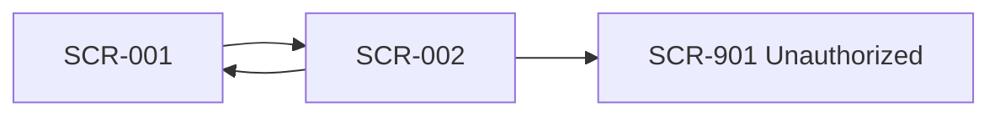

# Shared UI Navigation Rules

- common_design_id: CD-UI-002
- kind: ui
- artifact_type: navigation_rules

## Shared Purpose
<why these navigation rules are shared across multiple features>

## Navigation Map

## Rules
- list_to_detail: <shared rule>
- detail_to_list: <shared rule>
- save_complete: <shared rule>
- unauthorized: <shared rule>
- session_timeout: <shared rule>
- fatal_error: <shared rule>

## Exceptions
- <allowed exception or `none`>

## Downstream Usage
- <specific design or brief>
