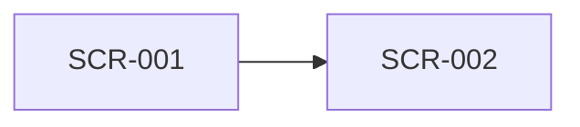

# Shared UI Screen Catalog

- common_design_id: CD-UI-001
- kind: ui
- artifact_type: screen_catalog

## Shared Purpose
<why this screen catalog is shared across multiple features>

## Screen Map

## Screens

### SCR-001 <screen name>
- purpose: <what this screen is for>
- actors:
  - <actor>
- entry_points:
  - <screen or navigation source>
- exits:
  - <screen id or `none`>
- permissions:
  - <permission or `none`>
- notes:
  - <shared note>

## Downstream Usage
- <specific design or brief>
