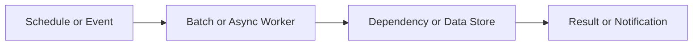

# Batch Design

## Execution Snapshot

```mermaid
flowchart LR
    TRIGGER["Schedule or Event"] --> BATCH["Batch or Async Worker"]
    BATCH --> TARGET["Dependency or Data Store"]
    TARGET --> RESULT["Result or Notification"]
```

## Batch And Async Responsibilities

- applicable: <yes or no>
- trigger: <schedule or event>
- purpose: <why it exists>
- dependencies:
  - <dependency>
