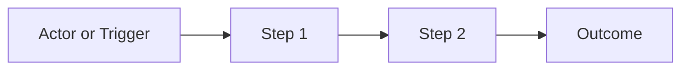

# Overview

- brief_id: <brief-id>
- design_id: <design-id>

## Goal
<overall design goal>

## Scope
- <scope item>

## Domain Context
- primary_domain: <domain id or `none`>
- related_briefs:
  - <brief-id or `none`>
- upstream_domains:
  - <domain id or `none`>
- downstream_domains:
  - <domain id or `none`>

## Common Design Context
- shared_design_refs:
  - <CD-API-001, CD-UI-001, or `none`>
- feature_specific_notes:
  - <how this feature applies the shared design>

## Flow Snapshot

## Primary Flow
1. <step>
2. <step>

## Non-Goals
- <out of scope item>
