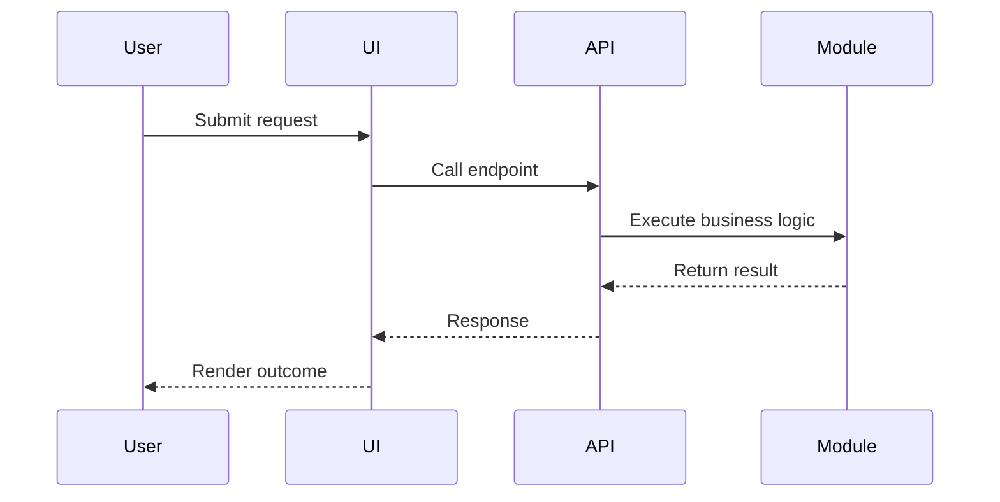

# Sequence Flow: Core Flow

- sequence_id: SEQ-001
- requirement_ids:
  - REQ-001

```mermaid
sequenceDiagram
    participant User
    participant UI
    participant API
    participant Module
    User->>UI: Submit request
    UI->>API: Call endpoint
    API->>Module: Execute business logic
    Module-->>API: Return result
    API-->>UI: Response
    UI-->>User: Render outcome
```
