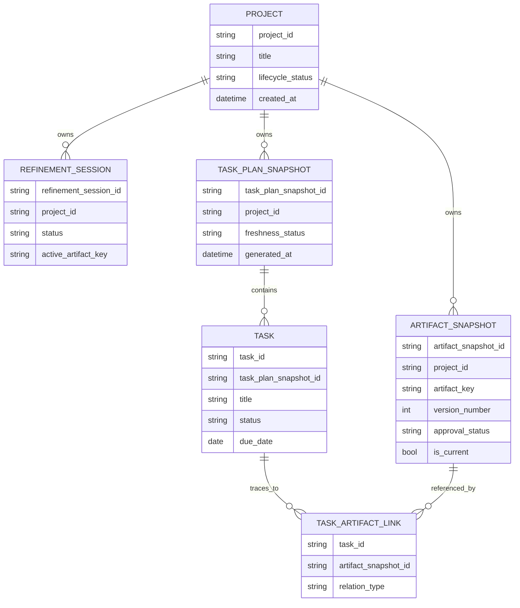

# CD-DATA-001 Shared Data Design

- common_design_id: CD-DATA-001
- kind: data

## Shared Purpose
CD-DATA-001 は、VibeToDo の intake input、artifact refinement、task synthesis、management workspace が同じ planning source of truth を共有するための canonical entity model である。`Project`、`RefinementSession`、`ArtifactSnapshot`、`TaskPlanSnapshot`、`Task` の意味が feature ごとに分かれると、approval、stale propagation、kanban/gantt の整合性が崩れるため、本モデルを shared data design として固定する。

この設計は単一機能の保存形式ではなく、`DOM-001` から `DOM-004` にまたがる durable model を定義する。PostgreSQL は初期実装先だが、entity meaning は storage implementation から独立していなければならない。

## Entity Relationship Snapshot

## Shared Entities

### ENT-001 Project
- purpose: intake から workspace までの全 workflow を束ねる root aggregate として機能する
- fields:
  - name: `project_id`
    type: string
    required: true
  - name: `title`
    type: string
    required: true
  - name: `planning_mode`
    type: string
    required: true
  - name: `lifecycle_status`
    type: string
    required: true
  - name: `created_at`
    type: datetime
    required: true
- invariants:
  - すべての artifact、task plan、task は 1 つの `Project` に帰属する
  - UI や provider は `Project` をまたいで artifact や task を共有してはならない

### ENT-002 RefinementSession
- purpose: project refinement の進行中状態、active artifact、AI 対話コンテキストを管理する
- fields:
  - name: `refinement_session_id`
    type: string
    required: true
  - name: `project_id`
    type: string
    required: true
  - name: `status`
    type: string
    required: true
  - name: `active_artifact_key`
    type: string
    required: true
  - name: `last_generation_at`
    type: datetime
    required: false
- invariants:
  - 同一 `Project` に同時に複数の active refinement session を持たない
  - session は project context を参照するが、artifact snapshot の履歴そのものを所有しない

### ENT-003 ArtifactSnapshot
- purpose: 各 canonical artifact の生成版、編集版、承認版を immutable snapshot として保持する
- fields:
  - name: `artifact_snapshot_id`
    type: string
    required: true
  - name: `project_id`
    type: string
    required: true
  - name: `artifact_key`
    type: string
    required: true
  - name: `version_number`
    type: int
    required: true
  - name: `approval_status`
    type: string
    required: true
  - name: `is_current`
    type: bool
    required: true
- invariants:
  - snapshot 作成後に本文と根拠メタデータを破壊的更新しない
  - `artifact_key` ごとに current snapshot は高々 1 件である
  - approved snapshot が上流変更で無効化された場合は current のままでも `stale` として扱える lifecycle を保持する

### ENT-004 TaskPlanSnapshot
- purpose: 承認済み artifact 群から生成された task plan の履歴単位を保持する
- fields:
  - name: `task_plan_snapshot_id`
    type: string
    required: true
  - name: `project_id`
    type: string
    required: true
  - name: `freshness_status`
    type: string
    required: true
  - name: `generated_from_artifact_set`
    type: string[]
    required: true
  - name: `generated_at`
    type: datetime
    required: true
- invariants:
  - task plan snapshot は approved かつ current な required artifact snapshot 群からのみ生成できる
  - 上流 artifact set が変化した時点で最新 task plan snapshot は `stale` 判定可能でなければならない

### ENT-005 Task
- purpose: execution UI が扱う canonical task shape の 1 レコードを表す
- fields:
  - name: `task_id`
    type: string
    required: true
  - name: `task_plan_snapshot_id`
    type: string
    required: true
  - name: `title`
    type: string
    required: true
  - name: `description`
    type: string
    required: true
  - name: `priority`
    type: string
    required: true
  - name: `status`
    type: string
    required: true
  - name: `due_date`
    type: date
    required: true
  - name: `dependencies`
    type: string[]
    required: true
  - name: `estimate`
    type: string
    required: true
  - name: `assignee`
    type: string
    required: true
- invariants:
  - `Task` は architecture principles の canonical task shape を必ず満たす
  - kanban、gantt、detail view は同一 `Task` record を参照し、parallel task schema を持たない

### ENT-006 TaskArtifactLink
- purpose: task がどの artifact snapshot または判断根拠から生成されたかを追跡する
- fields:
  - name: `task_id`
    type: string
    required: true
  - name: `artifact_snapshot_id`
    type: string
    required: true
  - name: `relation_type`
    type: string
    required: true
- invariants:
  - すべての `Task` は 1 件以上の artifact link を持つ
  - task update 後も traceability link を削除してはならない

## Downstream Usage
- `briefs/001-vibetodo-project-intake.md` は `Project` と `RefinementSession` の初期化を参照する
- `briefs/002-vibetodo-spec-refinement-workbench.md` は `RefinementSession` と `ArtifactSnapshot` の lifecycle を参照する
- `briefs/003-vibetodo-task-plan-synthesis.md` は `TaskPlanSnapshot`、`Task`、`TaskArtifactLink` を参照する
- `briefs/004-vibetodo-management-workspace.md` は `Task` と `TaskPlanSnapshot.freshness_status` を参照する
