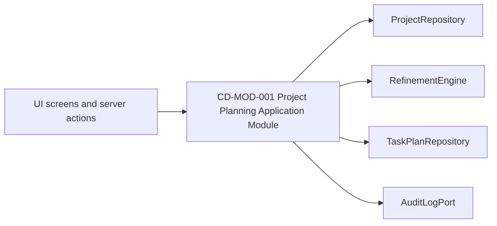

# CD-MOD-001 Shared Module Design

- common_design_id: CD-MOD-001
- kind: module

## Shared Purpose
CD-MOD-001 は、VibeToDo の intake、refinement、task synthesis、management workspace が workflow ルールを重複実装しないための canonical application module boundary である。画面や adapter が approval 条件、stale propagation、task publish 条件を個別に持つと、同じ `Project` でも挙動が分裂するため、この module は shared design として扱う。

この設計は UI 部品やインフラ実装の convenience layer ではなく、`DOM-001` から `DOM-004` をまたぐ orchestration rules の所有境界を定義する。provider 切り替えや persistence 差し替えは collaborator port で吸収し、module の public contract を変えない。

## Dependency Snapshot

## Public Responsibility
- responsibility: `Project` を root context として、intake 初期化、artifact generation、artifact approval、task synthesis、workspace mutation を一貫した workflow policy で公開する
- public_inputs:
  - `InitializeProjectFromIntake`
  - `SaveProjectDraft`
  - `StartOrResumeRefinementSession`
  - `GenerateArtifactDraft`
  - `ApproveOrRejectArtifact`
  - `SynthesizeTaskPlan`
  - `UpdateTask`
  - `ReturnExecutionFeedbackToRefinement`
- public_outputs:
  - `ProjectWorkspaceContext`
  - `ArtifactGenerationResult`
  - `ArtifactApprovalResult`
  - `TaskPlanSynthesisResult`
  - `TaskMutationResult`
  - `StaleImpactSummary`
- collaborators:
  - `ProjectRepository`
  - `RefinementSessionRepository`
  - `ArtifactRepository`
  - `TaskPlanRepository`
  - `LLMProvider` or `RefinementEngine`
  - `AuditLogPort`

## Collaboration Rules
- UI は command 意思と表示要求だけを渡し、approval gating や stale propagation を自前実装しない
- `RefinementEngine` は artifact draft の生成を担当するが、artifact sequence と approval policy の決定権はこの module にある
- repository collaborator は persistence detail を隠蔽し、module には PostgreSQL 固有 query や schema detail を漏らさない
- task update は workspace convenience のために存在しても、canonical task shape と artifact traceability の維持責務はこの module が持つ
- execution feedback から refinement に戻る導線は `SCR-005` 固有機能ではなく、本 module の workflow capability として扱う

## Downstream Usage
- `briefs/001-vibetodo-project-intake.md` は intake command と project initialization boundary を参照する
- `briefs/002-vibetodo-spec-refinement-workbench.md` は refinement command、approval command、stale impact summary を参照する
- `briefs/003-vibetodo-task-plan-synthesis.md` は task synthesis command と publish gating を参照する
- `briefs/004-vibetodo-management-workspace.md` は task mutation と refinement feedback return を参照する
