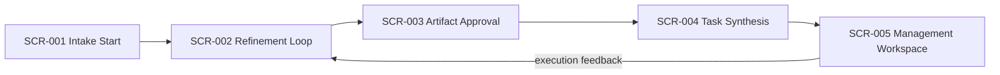

# CD-UI-001 Shared UI Screen Catalog

- common_design_id: CD-UI-001
- kind: ui
- artifact_type: screen_catalog

## Shared Purpose
CD-UI-001 は、VibeToDo の intake から refinement、task synthesis、management workspace までを 1 本の製品導線として扱うための shared screen catalog である。これは単一機能の画面仕様ではなく、`DOM-001 Project Intake`、`DOM-002 Spec Refinement`、`DOM-003 Task Planning`、`DOM-004 Management Workspace` を横断して再利用される canonical UI truth を定義する。

この設計を共通化する理由は、各 brief が個別画面を持ちながらも、ユーザー体験としては同じ project context と artifact/task source of truth を引き継ぐ必要があるためである。各 specific design は本カタログ上の screen ID と遷移前提を参照し、screen の役割そのものを再定義しない。

## Screen Map

## Screens

### SCR-001 Intake Start
- purpose: project または日々の仕事内容を、構造化テンプレート入力と自由文入力の両方で取り込み、refinement を始める前提を作る
- actors:
  - 個人ユーザー
- entry_points:
  - 新規プロジェクト開始
  - 下書き再開
- exits:
  - `SCR-002`
- permissions:
  - `none`
- notes:
  - intake 専用画面であり、refinement ルールや task 生成ロジックは内包しない
  - `001-vibetodo-project-intake` が主に参照するが、後続画面もこの screen が保存した project context を前提とする

### SCR-002 Refinement Loop
- purpose: 現在の project context と artifact progression を可視化しながら、AI 支援の文書精緻化を進める中心画面として機能する
- actors:
  - 個人ユーザー
  - LLM provider adapter
- entry_points:
  - `SCR-001`
  - `SCR-005`
- exits:
  - `SCR-003`
- permissions:
  - `none`
- notes:
  - conversational UI はこの screen の補助要素であり、独立した汎用チャット画面として切り出さない
  - artifact ごとの生成、質問、編集はここから始まるが、承認判断は `SCR-003` に委ねる

### SCR-003 Artifact Approval
- purpose: artifact 単位で差分、根拠、stale 影響を確認し、明示的に承認または差し戻しする review boundary を提供する
- actors:
  - 個人ユーザー
- entry_points:
  - `SCR-002`
- exits:
  - `SCR-002`
  - `SCR-004`
- permissions:
  - `none`
- notes:
  - approval は refinement flow の独立 screen responsibility として扱い、暗黙遷移で task synthesis に進めない
  - downstream artifact や task plan の stale 影響表示は shared behavior として各 specific design が踏襲する

### SCR-004 Task Synthesis
- purpose: 承認済み artifact 群を入力として dependency-ready な task plan を生成し、management workspace に渡す前の公開境界を担う
- actors:
  - 個人ユーザー
  - Task Planning アプリケーションサービス
- entry_points:
  - `SCR-003`
- exits:
  - `SCR-005`
- permissions:
  - `none`
- notes:
  - task 生成結果の確認と軽微な補正を行うが、継続的な task 実行管理は `SCR-005` の責務である
  - canonical task shape と artifact traceability を壊さずに公開する screen として扱う

### SCR-005 Management Workspace
- purpose: canonical task data を kanban、gantt、そのほか将来拡張される management tools で扱いながら、必要時に refinement へ戻す運用画面として機能する
- actors:
  - 個人ユーザー
- entry_points:
  - `SCR-004`
- exits:
  - `SCR-002`
- permissions:
  - `none`
- notes:
  - kanban と gantt は別 screen ではなく、同じ workspace の複数 view として共存する
  - execution feedback により refinement loop を再開できる導線を保ち、task 実行と文書精緻化を切断しない

## Downstream Usage
- `briefs/001-vibetodo-project-intake.md`
- `briefs/002-vibetodo-spec-refinement-workbench.md`
- `briefs/003-vibetodo-task-plan-synthesis.md`
- `briefs/004-vibetodo-management-workspace.md`
- 今後の `designs/specific_design/*` における UI bundle は、本 screen catalog の `SCR-001` から `SCR-005` の責務分割と導線を参照する
