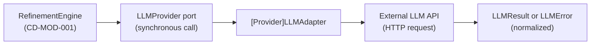

# Batch Design

## Execution Snapshot

## Batch And Async Responsibilities

- applicable: no
- trigger: not applicable
- purpose: LLM 呼び出しはリクエストスコープの同期処理として実行される。`RefinementEngine` がユーザーアクションまたは application service command に応じて `generateText` を呼び出すため、バッチ・非同期ワーカーは本設計の範囲外である。長時間 LLM 呼び出しの非同期化が必要な場合は DOM-002 設計で対処する。
- dependencies:
  - none

## Notes

- LLM API の応答待機はリクエスト内で完結する設計とする（MVP スコープ）
- ストリーミングレスポンス対応（長時間応答の進捗表示等）は MVP 後の拡張として本設計の Scope Out に含まれる
- レート制限・リトライの高度な制御も Scope Out であり、基本的なエラー伝播のみを実装する
