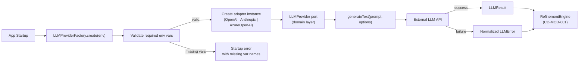

# Overview

- brief_id: 005-vibetodo-llm-provider-adapter
- design_id: 001-vibetodo-llm-provider-adapter

## Goal

OpenAI・Anthropic・Azure OpenAI の 3 プロバイダー向け adapter を実装し、domain 層が依存できる抽象 `LLMProvider` ポートとして隠蔽する。API キー・エンドポイント URL・モデル名などすべての可変設定を環境変数で一元管理し、コード変更なしにプロバイダーを切り替えられる状態にする。これにより CD-MOD-001 の `RefinementEngine` が実際の LLM を使って artifact 生成を行えるようになる。

## Scope

- `LLMProvider` 抽象インターフェース定義（domain 層が依存するポート）
- `LLMCallOptions`・`LLMResult`・`LLMError` 共通型定義
- `OpenAILLMAdapter` 実装（Chat Completions API）
- `AnthropicLLMAdapter` 実装（Messages API）
- `AzureOpenAILLMAdapter` 実装（Azure-hosted Chat Completions API）
- 全プロバイダーの環境変数スキーマ定義と `.env.example`
- `LLMProviderFactory` による起動時バリデーションと adapter 生成
- Docker Compose での `.env` 読み込みと環境変数パススルー

## Domain Context

- primary_domain: DOM-002
- related_briefs:
  - 002-vibetodo-spec-refinement-workbench
  - 003-vibetodo-task-plan-synthesis
- upstream_domains:
  - none
- downstream_domains:
  - DOM-002
  - DOM-003

## Common Design Context

- shared_design_refs:
  - CD-API-001
  - CD-MOD-001
- feature_specific_notes:
  - CD-API-001 不変条件「provider 固有情報は request/response の必須契約に含めない」に準拠するため、adapter は provider 固有の型・ヘッダー・ペイロード差異を外部に露出しない
  - CD-MOD-001 が定義する `LLMProvider` コラボレーター境界を実装する。module 本体は adapter SDK を直接 import せず、本設計が提供するポートインターフェース経由でのみ呼び出す
  - CD-UI-001 の画面（SCR-002 Refinement Loop）が LLM 呼び出しをトリガーするが、本設計は UI 画面を持たないインフラストラクチャ層として機能する

## Flow Snapshot

## Primary Flow

1. アプリケーション起動時に `LLMProviderFactory.create(process.env)` が呼び出される
2. Factory は `LLM_PROVIDER` 環境変数を読み込み、値が `openai`・`anthropic`・`azure_openai` のいずれかであることを検証する
3. 選択されたプロバイダーに必要な環境変数が揃っているかを検証し、欠損がある場合は欠損変数名を含むエラーで起動を中断する
4. バリデーション通過後、対応する adapter インスタンスを生成して `LLMProvider` ポートとして返す
5. `RefinementEngine`（CD-MOD-001）が `llmProvider.generateText(prompt, options)` を呼び出す
6. 選択された adapter がプロバイダー固有のリクエスト形式に変換して外部 API を呼び出す
7. API 呼び出しが成功した場合は `LLMResult` を返す
8. API 呼び出しが失敗した場合は provider 固有エラーを共通の `LLMError` 型に変換して返す

## Non-Goals

- プロンプトテンプレートの設計・管理（DOM-002 の責務）
- artifact 生成ロジックや refinement ワークフロー本体
- ストリーミングレスポンス対応（MVP 後の拡張）
- レート制限・リトライの高度な制御
- プロバイダーの UI 上でのランタイム切り替え
- 認証・マルチテナント機能
- LLM 以外の外部 AI サービス（画像生成・埋め込み等）
