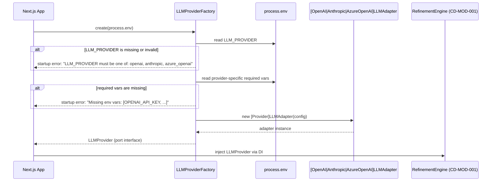
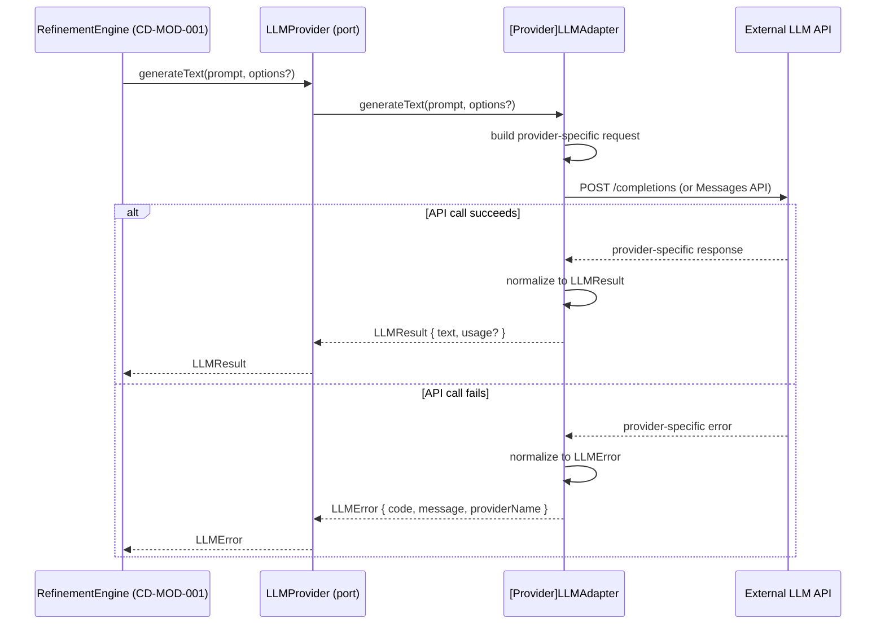

# Sequence Flow: Core Flow

- sequence_id: SEQ-001
- requirement_ids:
  - REQ-001
  - REQ-002
  - REQ-003
  - REQ-004
  - REQ-005
  - REQ-006
  - REQ-007

## SEQ-001-A: Provider Initialization at App Startup

アプリケーション起動時に `LLMProviderFactory` が環境変数を読み取り、バリデーションを行い、対応する adapter インスタンスを生成して返すフロー。

### SEQ-001-A Steps

1. Next.js アプリケーション起動時に `LLMProviderFactory.create(process.env)` が呼び出される
2. Factory は `LLM_PROVIDER` を読み取り、`openai`・`anthropic`・`azure_openai` のいずれかであることを確認する
3. 値が未設定または無効な場合、起動を中断して許容値一覧を含むエラーメッセージを出力する
4. 選択されたプロバイダーに対応する必須環境変数一覧を検証する
5. 欠損がある場合は欠損変数名を列挙したエラーで起動を中断する
6. バリデーション通過後に対応する adapter インスタンスを生成する
7. 生成した adapter を `LLMProvider` インターフェースとして返し、`RefinementEngine` へ DI する

---

## SEQ-001-B: Text Generation Call Flow

`RefinementEngine` が artifact 生成のために `LLMProvider.generateText` を呼び出すフロー。

### SEQ-001-B Steps

1. `RefinementEngine` が `llmProvider.generateText(prompt, options)` を呼び出す
2. 実行時 adapter（OpenAI・Anthropic・Azure OpenAI のいずれか）がプロバイダー固有のリクエスト形式に変換する
3. 外部 LLM API へ HTTP リクエストを送信する
4. 成功時はプロバイダー固有レスポンスを `LLMResult { text: string; usage?: LLMUsage }` に正規化して返す
5. 失敗時はプロバイダー固有エラーを `LLMError { code: LLMErrorCode; message: string; providerName: string }` に正規化して返す
6. `RefinementEngine` は `LLMResult` または `LLMError` を受け取り、artifact 生成ロジックに従って処理する

---

## External Dependencies

- OpenAI API：Chat Completions API（`POST https://api.openai.com/v1/chat/completions` または `OPENAI_API_BASE_URL` で指定したエンドポイント）
- Anthropic API：Messages API（`POST https://api.anthropic.com/v1/messages` または `ANTHROPIC_API_BASE_URL` で指定したエンドポイント）
- Azure OpenAI Service：`POST {AZURE_OPENAI_ENDPOINT}/openai/deployments/{AZURE_OPENAI_DEPLOYMENT_NAME}/chat/completions?api-version={AZURE_OPENAI_API_VERSION}`
