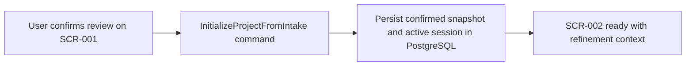

# Batch Design

## Execution Snapshot

## Batch And Async Responsibilities

- applicable: no
- trigger: user confirmation on the pre-start review state inside `SCR-001`
- purpose: intake confirmation completes synchronously so the user knows immediately whether the project context and refinement session are ready
- dependencies:
  - Next.js application server
  - CD-MOD-001 Project Planning Application Module
  - PostgreSQL

## Notes
- This feature does not introduce a separate batch worker or queue because REQ-004 only requires intake snapshot confirmation and session initialization.
- If future refinement warm-up logic becomes long-running, it should remain downstream in `DOM-002` rather than expanding intake scope.
