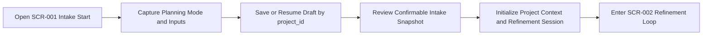

# Overview

- brief_id: 001-vibetodo-project-intake
- design_id: 001-vibetodo-project-intake

## Overview
本 design bundle は `DOM-001 Project Intake` の初期入力体験を定義する。ユーザーは `SCR-001 Intake Start` 上で `project` または `daily_work` の planning mode を選び、最小限の structured template 入力と free-form narrative を同時に保存し、review step で確認したうえで `DOM-002 Spec Refinement` へ引き渡す。

## Goal
ユーザーが負担の少ない intake flow で planning context を登録し、`Project` と `RefinementSession` を初期化して、後続の refinement workbench が同じ `project_id` を起点に再開と継続利用をできるようにする。

## Scope
- `SCR-001` 上で `project` と `daily_work` の 2 mode を提供し、mode ごとの minimum template fields を切り替える
- structured template input と free-form text を同一 draft context として保存する
- `project_id` を使った draft resume と再編集を可能にする
- review state で structured fields と narrative の両方を確認し、その場で修正して開始確定できるようにする
- review confirm 時に `draft_intake` project context を confirmed intake snapshot に昇格し、`active_artifact_key=objective_and_outcome` の refinement session を初期化する
- local Docker 環境で Next.js application と PostgreSQL を起動し、認証なしで intake feature を検証できるようにする

## Domain Context
- primary_domain: DOM-001
- related_briefs:
  - 002-vibetodo-spec-refinement-workbench
- upstream_domains:
  - none
- downstream_domains:
  - DOM-002

## Common Design Context
- shared_design_refs:
  - CD-DATA-001
  - CD-API-001
  - CD-MOD-001
  - CD-UI-001
- feature_specific_notes:
  - `CD-DATA-001` を参照し、draft save 時点で `Project.lifecycle_status=draft_intake` を維持しつつ、confirmed intake snapshot と active `RefinementSession` を初期化する
  - `CD-API-001` の `POST /api/projects` を intake create and resave command として使い、payload に `projectId` がある場合は同じ draft を更新する
  - `CD-MOD-001` に従い、screen は input capture と review orchestration だけを担当し、session 初期化や persistence rule を UI に埋め込まない
  - `CD-UI-001` の `SCR-001 Intake Start` を shared screen ref とし、review confirm 後にのみ `SCR-002 Refinement Loop` へ遷移する
  - brief `002-vibetodo-spec-refinement-workbench` review では、workspace context に confirmed intake snapshot が十分含まれているかを cross-domain point として確認する

## Flow Snapshot

## Primary Flow
1. Open `SCR-001 Intake Start` as a new draft or resumed draft keyed by `project_id`.
2. Capture planning mode, required template fields for that mode, and free-form context in the same editing surface.
3. Save or resume the draft so the same `Project` can be reloaded without authentication in the local environment.
4. Review the confirmable intake snapshot, inspecting both structured entries and free-form text with in-place edit access.
5. Confirm the intake so the application module stores current project context and creates the first active `RefinementSession`.
6. Enter `SCR-002 Refinement Loop` with `active_artifact_key=objective_and_outcome` and the confirmed intake snapshot as the generation basis.

## Non-Goals
- artifact generation, approval workflow, and diff review UI
- task plan synthesis, kanban, gantt, and management views
- authentication, team ownership, or multi-tenant partitioning
- provider-specific LLM selection UI or prompt authoring
