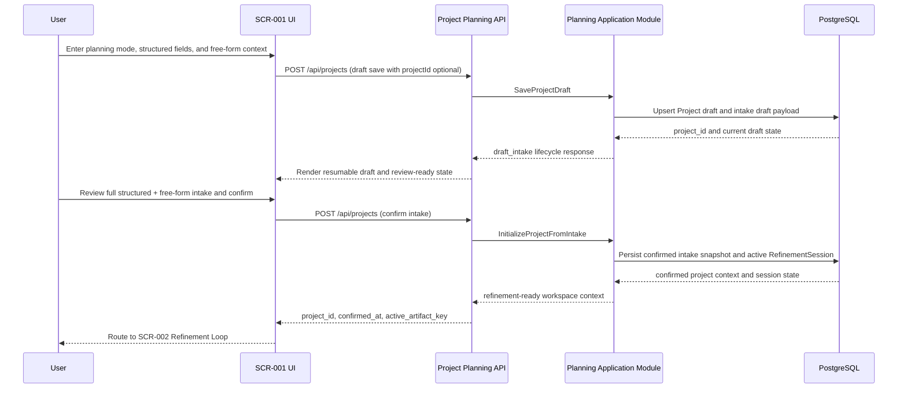

# Sequence Flow: Core Flow

- sequence_id: SEQ-001
- requirement_ids:
  - REQ-001
  - REQ-003
  - REQ-004
  - REQ-005
  - REQ-006

## Sequence Notes
- `SCR-001` is responsible for capture, draft persistence triggers, review display, and transition intent only.
- The API call stays anchored on `project_id` so resumed drafts do not fork into duplicate projects.
- Review confirmation must persist structured input, free-form input, `planning_mode`, and `confirmed_at` in the same project context write.
- The handoff to `SCR-002` is blocked until the module confirms one active `RefinementSession` with `active_artifact_key=objective_and_outcome`.
- Local Docker deployment readiness affects this flow because the Next.js application and PostgreSQL must both be available for save, resume, and confirm operations.
