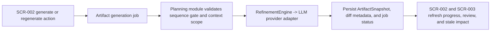

# Batch Design

## Execution Snapshot

## Batch And Async Responsibilities

- applicable: yes
- trigger: user-triggered generate or regenerate actions on `SCR-002`
- purpose: isolate long-running artifact generation so the UI can report progress, retry failures, and preserve the current approved snapshot
- dependencies:
  - Next.js application server
  - CD-MOD-001 Project Planning Application Module
  - `RefinementEngine` provider port
  - OpenAI, Anthropic, or Azure OpenAI adapter implementation
  - PostgreSQL

## Notes
- Async handling applies to artifact generation jobs only; approval decisions remain explicit user commands on `SCR-003`.
- Each job must surface `queued`, `running`, `failed`, `retryable`, or `completed` so the UI does not collapse long-running AI work into a spinner-only state.
- On failure, the module keeps the last approved snapshot current and allows retry against the same `project_id` and `artifact_key`.
- When an upstream artifact is regenerated and then approved, stale downstream artifacts and the latest task plan snapshot are updated as part of the same workflow contract rather than a detached background repair job.
