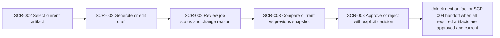

# Overview

- brief_id: 002-vibetodo-spec-refinement-workbench
- design_id: 002-vibetodo-spec-refinement-workbench

## Overview
本 design bundle は `DOM-002 Spec Refinement` の中心 workflow を定義する。`SCR-002 Refinement Loop` で canonical artifact sequence を 1 件ずつ生成・編集・再生成し、`SCR-003 Artifact Approval` で差分、変更理由、stale 影響を確認して明示的に承認または差し戻す。承認済み artifact 群だけが `SCR-004 Task Synthesis` へ handoff され、途中の chat や下書き変更が暗黙に本文を確定しないことを前提とする。

## Goal
`project_id` を root context とした refinement workbench を提供し、`project` と `daily_work` の両 planning mode で同じ required artifact sequence を安全に前進させながら、承認済みで traceable な planning basis を `DOM-003 Task Planning` へ引き渡せるようにする。

## Scope
- `objective_and_outcome` から `risks_assumptions_and_open_questions` までの canonical artifact sequence を `SCR-002` 上で可視化し、current artifact が approved になるまで次工程を解放しない
- active `project_id`、active `artifact_key`、approved かつ current な upstream artifact snapshot だけを使う context-bound AI refinement loop を提供する
- artifact draft、直前 snapshot との差分、変更理由、approval decision、decision reason を `SCR-003` 上で review できるようにする
- generate、regenerate、user edit のたびに immutable `ArtifactSnapshot` と監査情報を保存し、current snapshot と previous snapshot の diff を取得できるようにする
- upstream artifact の変更または再承認時に downstream artifact と最新 task plan snapshot を stale として可視化し、再生成または再承認が完了するまで planning basis として扱わない
- LLM provider adapter を抽象化された `RefinementEngine` 経由で呼び出し、OpenAI、Anthropic、Azure OpenAI への差し替えを workflow 変更なしで扱えるようにする
- 長時間 generation を async job として扱い、`queued`、`running`、`failed`、`retryable`、`completed` の進捗と retry affordance を UI に反映する

## Domain Context
- primary_domain: DOM-002
- related_briefs:
  - 001-vibetodo-project-intake
  - 003-vibetodo-task-plan-synthesis
  - 004-vibetodo-management-workspace
- upstream_domains:
  - DOM-001
- downstream_domains:
  - DOM-003
  - DOM-004

## Common Design Context
- shared_design_refs:
  - CD-DATA-001
  - CD-API-001
  - CD-MOD-001
  - CD-UI-001
- feature_specific_notes:
  - `CD-DATA-001` を参照し、`RefinementSession.active_artifact_key`、artifact sequence ごとの `ArtifactSnapshot`、approval audit、task plan stale 状態を同一 `project_id` 配下で扱う
  - `CD-API-001` の workspace context、artifact generation、artifact approval contract をそのまま使用し、provider 固有情報を UI surface に持ち込まない
  - `CD-MOD-001` に従い、artifact gating、stale propagation、approval boundary、retry policy は application module が所有し、`SCR-002` と `SCR-003` は orchestration と rendering に徹する
  - `CD-UI-001` の shared screen catalog を踏襲し、`SCR-002` は refinement workspace、`SCR-003` は approval boundary、`SCR-004` は task synthesis handoff 先として扱う
  - brief `001-vibetodo-project-intake` review では confirmed intake snapshot が first artifact generation に十分かを確認し、brief `003-vibetodo-task-plan-synthesis` review では ready gating と stale task plan semantics を確認する
  - brief `004-vibetodo-management-workspace` review では stale task plan reason と refinement feedback return path が workspace read-only rule と整合しているかを確認する

## Flow Snapshot

## Primary Flow
1. `SCR-002` loads workspace context for the active `project_id`, showing the canonical artifact sequence and the current `active_artifact_key`.
2. The user opens one artifact at a time, sees only approved and current upstream snapshots as generation context, and can edit the current draft without auto-promoting it.
3. Generate or regenerate triggers an async artifact generation job through the shared API, and the UI tracks `queued` to `completed` states without discarding the current approved snapshot on failure.
4. When a new current snapshot exists, `SCR-002` shows the change reason, the previous snapshot link, and any downstream stale impact before the user moves to approval.
5. `SCR-003` displays current draft, previous snapshot diff, approval history, and stale impact so the user can explicitly approve or reject the snapshot with a decision reason.
6. Approval updates readiness for the next artifact in sequence; if an upstream approved artifact changes, downstream artifacts and the latest task plan are marked stale until regenerated or re-approved.
7. After the full required artifact set is approved and current, the workbench exposes the `SCR-004 Task Synthesis` handoff instead of generating tasks inline.

## Non-Goals
- initial mixed-input intake capture and review logic owned by `001-vibetodo-project-intake`
- task decomposition, publish boundary, and canonical task shaping owned by `003-vibetodo-task-plan-synthesis`
- kanban, gantt, and workspace execution controls owned by `004-vibetodo-management-workspace`
- provider-specific prompt editing UI, vendor-specific model knobs, or general-purpose chat behavior
