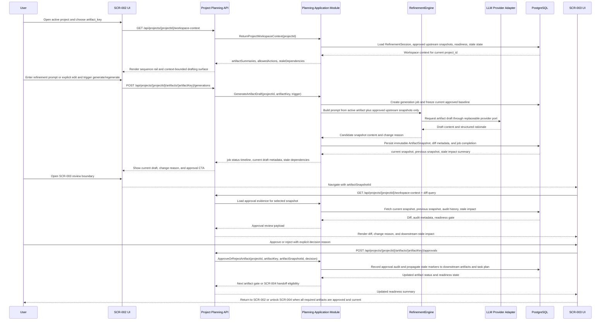

# Sequence Flow: Core Flow

- sequence_id: SEQ-001
- requirement_ids:
  - REQ-001
  - REQ-002
  - REQ-003
  - REQ-004
  - REQ-005
  - REQ-006
  - REQ-007

## Sequence Notes
- `SCR-002` owns artifact drafting, explicit edit intent, upstream context visibility, and async generation status, but it never approves snapshots.
- The generation prompt is built from the active `project_id`, the active `artifact_key`, and approved current upstream artifacts only; generic chat requests are rejected or redirected.
- `SCR-003` is the only screen that records approve or reject decisions, and each decision is attached to one immutable `artifactSnapshotId`.
- Stale propagation is part of the same approval and current-snapshot update path so `003-vibetodo-task-plan-synthesis` and `004-vibetodo-management-workspace` can trust the freshness signal.
- Cross-domain review with `001-vibetodo-project-intake` should verify that the confirmed intake snapshot is rich enough for the first artifact; review with `003` and `004` should verify that readiness and stale semantics are consumed without reinterpretation.
