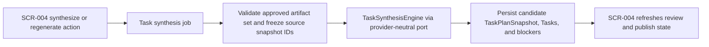

# Batch Design

## Execution Snapshot

## Batch And Async Responsibilities

- applicable: yes
- trigger: user-triggered synthesize or regenerate action on `SCR-004`
- purpose: isolate provider-assisted or long-running task planning so the UI can expose progress, retry failure, and keep the last published plan safe while a new candidate is generated
- dependencies:
  - Next.js application server
  - CD-MOD-001 Project Planning Application Module
  - `TaskPlanRepository`
  - `TaskSynthesisEngine`
  - OpenAI, Anthropic, or Azure OpenAI adapter implementation
  - PostgreSQL

## Notes
- Async handling applies to candidate task plan generation and regeneration only; publish stays an explicit foreground action because it changes the current editable plan for `SCR-005`.
- Each job must surface `queued`, `running`, `failed`, `retryable`, or `completed` so the user can tell whether a new candidate exists, is blocked, or can be retried.
- A failed synthesis job must not discard the last published task plan, even when the latest candidate snapshot is incomplete or invalid.
- Placeholder values for `Due Date`, `Estimate`, and `Assignee` may be produced during async synthesis, but they must be recorded with reasons so publish blockers can explain whether user review is still required.
- Stale propagation is not a detached repair batch. When upstream approved artifacts change, the same workflow contract marks the published task plan stale and forces regeneration before the workspace returns to editable mode.
