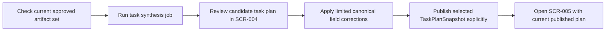

# Overview

- brief_id: 003-vibetodo-task-plan-synthesis
- design_id: 003-vibetodo-task-plan-synthesis

## Overview
本 design bundle は `DOM-003 Task Planning` の publish-aware synthesis workflow を定義する。`SCR-004 Task Synthesis` は、`DOM-002 Spec Refinement` で current かつ approved な required artifact set が揃っていることを確認したうえで task plan を生成し、canonical task shape と artifact traceability を保ったまま review、軽微な補正、publish を行う review boundary として機能する。

生成された task plan は publish 前には `SCR-005 Management Workspace` の current editable plan として扱わず、上流 artifact が変化した時点で stale に戻る。これにより、task synthesis は単なる ToDo 自動生成ではなく、文書承認フローと管理ワークスペースの間にある planning source of truth の確定工程になる。

## Goal
承認済み artifact 群から dependency-ready な canonical task set を生成し、`SCR-004` 上で traceability を維持した review と軽微補正を行ってから明示的に publish し、`SCR-005` がそのまま current published `TaskPlanSnapshot` を利用できるようにする。

## Scope
- current approved artifact set の eligibility 判定と不足・stale artifact の可視化
- `SCR-004` 上での task synthesis job 起動、進捗表示、retry affordance
- generated `TaskPlanSnapshot` ごとの immutable 保存、source artifact snapshot IDs の保持、task diff review 前提の snapshot 管理
- task 一覧、task detail、dependency、estimate、assignee、due date、priority の review と補正
- `Related Artifacts` を維持した traceability 表示と publish blocker の明示
- explicit publish による current published task plan の切り替えと `SCR-005` handoff
- upstream artifact 変更時の stale propagation と再生成導線

## Domain Context
- primary_domain: DOM-003
- related_briefs:
  - 002-vibetodo-spec-refinement-workbench
  - 004-vibetodo-management-workspace
- upstream_domains:
  - DOM-002
- downstream_domains:
  - DOM-004

## Common Design Context
- shared_design_refs:
  - CD-DATA-001
  - CD-API-001
  - CD-MOD-001
  - CD-UI-001
- feature_specific_notes:
  - `CD-DATA-001` を参照し、`TaskPlanSnapshot`、`Task`、`TaskArtifactLink` を `project_id` 配下の immutable planning evidence として扱い、publish 前 candidate と current published snapshot を混同しない
  - `CD-API-001` の shared request fields を使い、`POST /api/projects/{projectId}/task-plans` を synthesis candidate 作成と explicit publish の両方に利用する。publish は `taskPlanSnapshotId` と `approvalDecision=publish` を明示し、暗黙 handoff を禁止する
  - `CD-MOD-001` に従い、eligibility gate、placeholder 生成方針、publish blocker 判定、stale propagation は application module が所有し、`SCR-004` は review と correction orchestration に徹する
  - `CD-UI-001` の `SCR-004 Task Synthesis` を shared screen ref とし、publish 成功時のみ `SCR-005 Management Workspace` を current editable plan として開く
  - brief `002-vibetodo-spec-refinement-workbench` review では required artifact sequence の current approved semantics、stale reason payload、artifact snapshot traceability を cross-domain point として確認する
  - brief `004-vibetodo-management-workspace` review では published-only visibility、stale read-only 切り替え、kanban/gantt が同一 current published `TaskPlanSnapshot` を読むことを cross-domain point として確認する

## Flow Snapshot

## Primary Flow
1. `SCR-004` loads workspace context for the active `project_id` and verifies that every required artifact in the shared sequence has a current approved snapshot with no stale dependency.
2. If the planning basis is incomplete, the screen lists missing or stale `artifact_key` values and keeps synthesis actions disabled until `DOM-002` restores readiness.
3. When the basis is eligible, the user triggers synthesis and the module creates an async job that records source artifact snapshot IDs before any provider-assisted planning work begins.
4. The module persists a candidate `TaskPlanSnapshot` and its `Task` records with canonical fields, dependency metadata, publish blockers, and `TaskArtifactLink` rows that back `Related Artifacts`.
5. `SCR-004` renders the candidate task set, lets the user correct existing canonical field values and dependency links, and forbids task add, delete, or traceability-loss operations.
6. Publish remains disabled until every task in the selected snapshot has non-null required fields, at least one related artifact, and no unresolved generation failure reason.
7. On explicit publish, the selected snapshot becomes the current published task plan and `SCR-005` receives the handoff; if any upstream approved artifact later changes, this plan becomes stale and must be regenerated or republished before it is editable again.

## Non-Goals
- artifact drafting, approval diffs, and upstream stale propagation UI owned by `002-vibetodo-spec-refinement-workbench`
- kanban, gantt, task execution controls, or refinement feedback detail UI owned by `004-vibetodo-management-workspace`
- external PM tool sync, team permissions, or multi-user assignment policies
- free-form task creation or ad hoc task deletion outside the synthesized canonical task shape
