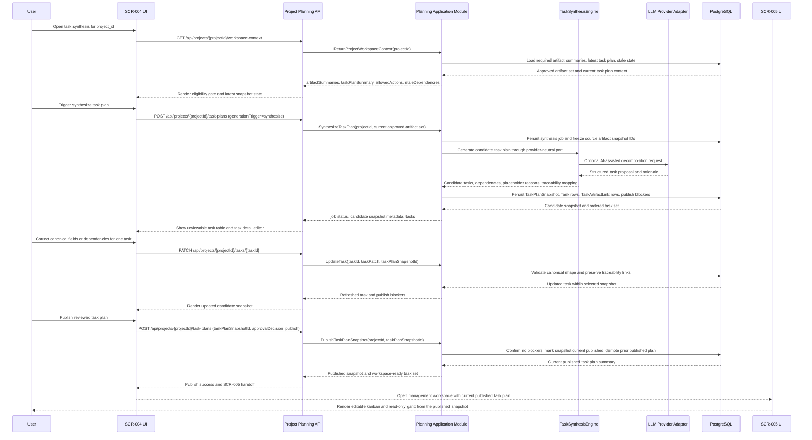

# Sequence Flow: Core Flow

- sequence_id: SEQ-001
- requirement_ids:
  - REQ-001
  - REQ-002
  - REQ-003
  - REQ-004
  - REQ-005
  - REQ-006
  - REQ-007
  - REQ-008
  - REQ-009

## Sequence Notes
- The eligibility gate depends on the same required artifact sequence produced by `002-vibetodo-spec-refinement-workbench`; `SCR-004` does not reinterpret readiness locally.
- Candidate task plans and the current published task plan are separate snapshot states. Generation and correction never auto-promote a candidate into the workspace source of truth.
- Pre-publish correction is intentionally narrow: field values and dependencies may change, but task identity, snapshot traceability, and artifact links must survive every patch.
- Publish succeeds only when every task has non-null canonical required fields, at least one related artifact link, and no unresolved synthesis failure reason.
- If any source artifact in the published task plan is later replaced by a newer approved snapshot, the module marks the task plan `stale`; `SCR-004` becomes the regeneration and republish boundary, and `SCR-005` must treat the stale plan as read-only.
