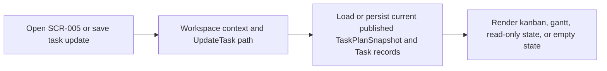

# Batch Design

## Execution Snapshot

## Batch And Async Responsibilities

- applicable: no
- trigger: workspace load, task patch save, or refinement-return navigation from `SCR-005`
- purpose: management workspace consumes already-published task data synchronously; long-running generation or stale propagation remains owned upstream by `DOM-002` and `DOM-003`
- dependencies:
  - Next.js application server
  - CD-MOD-001 Project Planning Application Module
  - PostgreSQL
  - current published `TaskPlanSnapshot`

## Notes
- This feature does not add a new queue or worker because kanban, gantt, and task detail are projections over existing canonical task data.
- If upstream artifact approval or task-plan regeneration marks the plan stale, `SCR-005` consumes that lifecycle state on the next workspace refresh instead of repairing freshness locally.
- Future management tools may add expensive analytics, but the MVP boundary keeps task mutation and feedback handoff synchronous so the user can immediately see whether the plan is editable.
