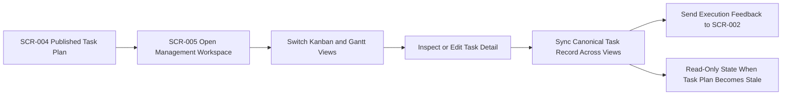

# Overview

- brief_id: 004-vibetodo-management-workspace
- design_id: 004-vibetodo-management-workspace

## Overview
本 design bundle は `DOM-004 Management Workspace` の具体設計であり、`SCR-005 Management Workspace` を current published `TaskPlanSnapshot` の唯一の運用画面として定義する。kanban、gantt、task detail、artifact health は別々の planning logic を持たず、`DOM-003 Task Planning` が publish した canonical task data と freshness state をそのまま消費する。

## Goal
ユーザーが 1 つの workspace shell 内で task 実行、進捗確認、stale 判定の把握、refinement feedback handoff を行いながら、`SCR-004 Task Synthesis` から引き継いだ current plan を安全に管理できるようにする。

## Scope
- `SCR-005` で current published task plan を kanban view と gantt view の両方に表示する
- kanban、gantt、task detail、artifact health を同一 `TaskPlanSnapshot` と `Task` source of truth で同期する
- `freshness_status=current` の場合に限り `Status`、`Description`、`Priority`、`Due Date`、`Dependencies`、`Estimate`、`Assignee` を編集可能にする
- stale task plan の reason と blocked follow-up を表示し、workspace 全体を read-only に切り替える
- task detail または artifact health から `SCR-002 Refinement Loop` へ feedback context を handoff する
- current published task plan が存在しない場合、`SCR-004 Task Synthesis` へ戻す empty state を表示する
- local Docker 前提で Next.js application と PostgreSQL を起動し、単一ユーザーが認証なしで workspace を使えるようにする

## Domain Context
- primary_domain: DOM-004
- related_briefs:
  - 002-vibetodo-spec-refinement-workbench
  - 003-vibetodo-task-plan-synthesis
- upstream_domains:
  - DOM-002
  - DOM-003
- downstream_domains:
  - none

## Common Design Context
- shared_design_refs:
  - CD-DATA-001
  - CD-API-001
  - CD-MOD-001
  - CD-UI-001
- feature_specific_notes:
  - `CD-DATA-001` を参照し、workspace は current published `TaskPlanSnapshot` とその配下 `Task` 群のみを editable source として扱う
  - `CD-API-001` の `GET /api/projects/{projectId}/workspace-context` と `PATCH /api/projects/{projectId}/tasks/{taskId}` を使い、board、timeline、detail を同一 contract で同期する
  - `CD-MOD-001` に従い、freshness gate、traceability 保持、feedback handoff capability は application module 側で所有し、UI は表示と command intent に限定する
  - `CD-UI-001` の `SCR-005 Management Workspace` を共有 screen とし、kanban と gantt は同一 workspace の view state として共存させる
  - brief `003-vibetodo-task-plan-synthesis` review では publish boundary と stale handoff semantics を、brief `002-vibetodo-spec-refinement-workbench` review では feedback return context と stale reason wording を cross-domain point として確認する

## Flow Snapshot

## Primary Flow
1. Open `SCR-005` from `SCR-004` after a task plan has been explicitly published for the current `project_id`.
2. Load the current published `TaskPlanSnapshot`, task collection, artifact health summary, and allowed actions through the shared workspace-context contract.
3. Let the user switch between kanban and gantt while both views remain projections of the same canonical task records.
4. Open task detail from either view and allow edits only when the current plan remains `freshness_status=current`.
5. Reflect a saved task mutation immediately across board counts, gantt markers, task detail, and artifact references without rebuilding a second local plan.
6. If the user identifies a blocker or stale upstream assumption, route back to `SCR-002` with `project_id`, `task_id`, `artifact_snapshot_id`, and feedback note as transient handoff context instead of persisting a separate feedback record.

## Non-Goals
- artifact generation or approval UI already owned by `SCR-002` and `SCR-003`
- task plan generation or publish boundary behavior already owned by `SCR-004`
- multi-user assignment workflows, authentication, or permission rules
- direct gantt drag-resize editing in the MVP
- external project-management SaaS export or sync
