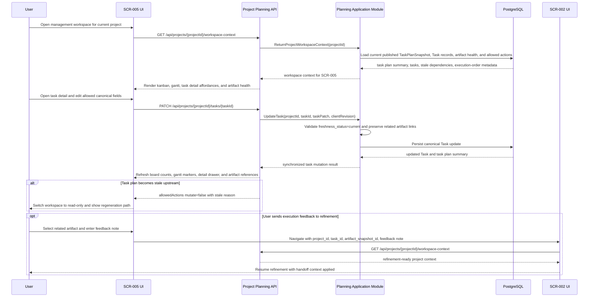

# Sequence Flow: Core Flow

- sequence_id: SEQ-001
- requirement_ids:
  - REQ-001
  - REQ-002
  - REQ-003
  - REQ-004
  - REQ-005
  - REQ-007

## Sequence Notes
- `SCR-005` owns visual orchestration only; it does not calculate a second task plan or persist execution feedback as an independent record.
- `GET /api/projects/{projectId}/workspace-context` is the common hydration path for kanban, gantt, artifact health, stale state, and empty-plan state.
- `PATCH /api/projects/{projectId}/tasks/{taskId}` must reject mutations when `TaskPlanSnapshot.freshness_status` is not current.
- The same updated `Task` response drives board, gantt, and detail synchronization so the workspace never forks local state per view.
- Cross-domain review with `003-vibetodo-task-plan-synthesis` should verify that only published snapshots are exposed here; review with `002-vibetodo-spec-refinement-workbench` should verify that feedback handoff context is sufficient without introducing workspace-owned persistence.
